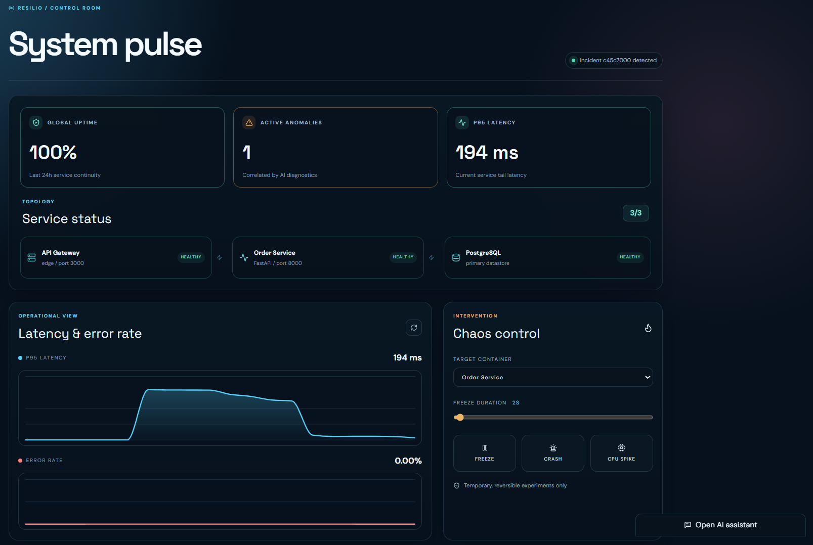
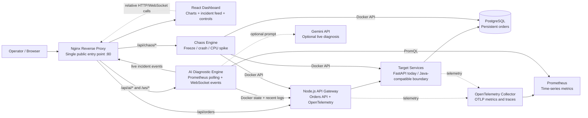

# Resilio

## AI-Powered Distributed System Reliability Platform

Resilio is a containerized reliability platform for diagnosing and recovering from cascading failures in microservice architectures. It combines real request telemetry, service-state inspection, controlled fault injection, and an AI-assisted incident workflow into one operational control room.

When a dependency becomes slow or unavailable, Resilio correlates latency, 5xx rates, container state, and recent logs. It then publishes a live incident event and produces either a Gemini-backed diagnosis or a transparent local heuristic diagnosis when an external AI key is unavailable.

## Dashboard Preview



## Architecture



All services communicate over the private `resilio-net` bridge network. Only Nginx publishes a host port. The current target implementation is a Python FastAPI order service; the gateway and telemetry contracts are service-oriented rather than tied to that implementation language.

## Technology Stack

- **Runtime and services:** Node.js, Express, Python 3.12, FastAPI, Uvicorn
- **Frontend:** React 18, Vite, Recharts, Lucide React
- **Networking:** Nginx reverse proxy, REST APIs, WebSockets
- **Observability:** OpenTelemetry SDKs, OpenTelemetry Collector, Prometheus, PromQL
- **Persistence:** PostgreSQL, SQLAlchemy, psycopg2
- **Resilience testing:** Docker-backed freeze, crash/restart, and CPU-spike experiments
- **AI diagnosis:** Gemini API with a local evidence-based heuristic fallback
- **Packaging and deployment:** Docker Compose, multi-architecture official base images, Oracle Cloud or Azure VM deployment

## Key Features

### Live reliability telemetry

- Prometheus collects request latency histograms and 5xx counters exported through OpenTelemetry.
- The AI Engine polls telemetry every five seconds and broadcasts health events over WebSockets.
- The dashboard displays p95 latency, error rate, service state, topology health, and incident history.

### Controlled chaos injection

The Chaos Engine uses the Docker API to run reversible experiments against a selected container:

- **Freeze:** pauses a container for a bounded duration, then resumes it.
- **Crash:** kills and restarts a container.
- **CPU spike:** creates temporary CPU pressure for 15 seconds.

These experiments create real changes in container state and request behavior. They are not a prerecorded animation or synthetic chart.

### Dual diagnosis engine

- **Live Gemini Analysis:** uses the current anomaly, recent container logs, and telemetry as the diagnosis context when `GEMINI_API_KEY` is configured.
- **Local Heuristic Analysis:** remains available without an API key and reports evidence-based confidence:
  - `90%` when latency and 5xx evidence share an explicit service identity
  - `80%` when one metric strongly supports the diagnosis
  - `65%` when the evidence is uncertain

Every incident includes a `diagnosis_source` field so operators can distinguish Gemini output from local analysis.

### Constrained-VM operation

The Compose configuration includes restart policies and resource limits sized for a highly constrained VM. Gateway and order-service limits prevent a chaos experiment from consuming the entire host, while PostgreSQL is configured with reduced `shared_buffers` and `max_connections`.

## Repository Layout

```text
.
├── ai-engine/                 # Prometheus correlation, diagnosis, WebSocket stream
├── chaos-engine/              # Docker-backed fault injection API
├── dashboard/                 # React operational control room
├── database/                  # PostgreSQL initialization schema
├── gateway/                   # Node.js order API gateway and tracing
├── nginx/                     # Public reverse proxy
├── order-service/             # FastAPI order service and SQLAlchemy persistence
├── docker-compose.yml         # Private network, limits, dependencies, volumes
├── otel-collector-config.yaml
└── prometheus.yml
```

## Run Locally

### Prerequisites

- Docker Desktop or Docker Engine with Compose v2
- At least 2 GB RAM recommended for local development
- A URL-safe PostgreSQL password

### Start the stack

```bash
cp .env.example .env
```

Edit `.env` and set a strong password:

```dotenv
POSTGRES_PASSWORD=replace_with_a_long_random_url_safe_password
GEMINI_API_KEY=
GEMINI_MODEL=gemini-2.0-flash
```

Start all services:

```bash
docker compose up --build -d
```

Open the dashboard at <http://localhost/>.

Useful operational commands:

```bash
docker compose ps
docker compose logs -f ai-engine
docker compose logs -f nginx
docker compose down
```

The database and Prometheus data are stored in named Docker volumes. Do not run `docker compose down -v` unless you intentionally want to delete them.

## Reproducible Incident Demonstration

The following sequence creates normal traffic, freezes PostgreSQL for five seconds, and retrieves the resulting AI post-mortem. Run it from the project host while the stack is running.

### 1. Generate baseline order traffic

```bash
curl http://localhost/api/orders

curl -X POST http://localhost/api/orders \
  -H "Content-Type: application/json" \
  -d '{"customer_name":"Reliability Demo","product":"Failure Analysis","quantity":1}'
```

### 2. Freeze the database

```bash
curl -X POST http://localhost/api/chaos/freeze \
  -H "Content-Type: application/json" \
  -d '{"container_name":"resilio-postgres","duration":5}'
```

The request pauses the actual PostgreSQL container and resumes it automatically. During the pause, requests that depend on the database may become slow or fail. The AI Engine polls every five seconds, so wait approximately 10 to 15 seconds for correlation.

### 3. View the post-mortem

```bash
curl http://localhost/api/incidents/latest
```

The response contains the anomaly timestamp, metrics, service states, correlated logs, root-cause service, confidence score, diagnosis source, and remediation recommendation.

You can also open <http://localhost/> and observe the latency chart, service topology, and Incident Feed. Expand **View deep telemetry context** to inspect the Prometheus metrics and Docker logs attached to the incident.

### 4. Ask the AI operations copilot

```bash
curl -X POST http://localhost/api/ai/chat \
  -H "Content-Type: application/json" \
  -d '{"query":"What happened during the database freeze and which service was affected?"}'
```

Without `GEMINI_API_KEY`, the endpoint still responds using the local telemetry-aware fallback. With a valid key, the response is generated by Gemini using the current system state.

## Production Deployment on Oracle Cloud

The same Compose stack can run on an ARM-based Oracle Cloud VM. Official Node, Python, Nginx, and PostgreSQL images used by this project publish `linux/arm64` variants.

On the VM:

```bash
git clone <YOUR_REPOSITORY_URL> resilio
cd resilio
cp .env.example .env
nano .env
docker compose up --build -d
```

Set a strong URL-safe `POSTGRES_PASSWORD` before starting. Configure the Oracle Cloud security list and the VM firewall to allow inbound TCP port `80`. Then browse to:

```text
http://<ORACLE_VM_PUBLIC_IP>/
```

The frontend uses relative paths, so the public IP is not compiled into the React bundle. Browser requests for `/api/orders`, `/api/ai/chat`, `/api/chaos/*`, and `/ws/incidents` return to the same public host and are routed internally by Nginx. A DNS name can replace the IP without rebuilding the frontend.

## Resource and Security Notes

- Only Nginx exposes `80:80`; PostgreSQL, Prometheus, the dashboard, and backend services are private.
- Database credentials come from `.env`; never commit `.env` or real API keys.
- The AI and Chaos Engines require access to `/var/run/docker.sock` to inspect and control containers. This is powerful host access and should be replaced with a restricted control plane for a hardened multi-tenant production environment.
- The current resource limits are designed for a 1 vCPU / 1 GB VM and leave limited headroom for the host OS. Monitor memory before running extended chaos experiments.
- Use HTTPS with a domain and a TLS certificate before exposing the system beyond a portfolio demonstration.

## Reliability Workflow

```text
Request traffic
    -> Gateway and target service
    -> OpenTelemetry Collector
    -> Prometheus
    -> AI Engine correlation
    -> WebSocket incident event
    -> Dashboard post-mortem and remediation
```

The important design property is that diagnosis is grounded in observable system state: metrics, container status, and recent logs are collected at incident time rather than fabricated in the UI.

## Ownership

Designed, built, and maintained by **Ashish**.
